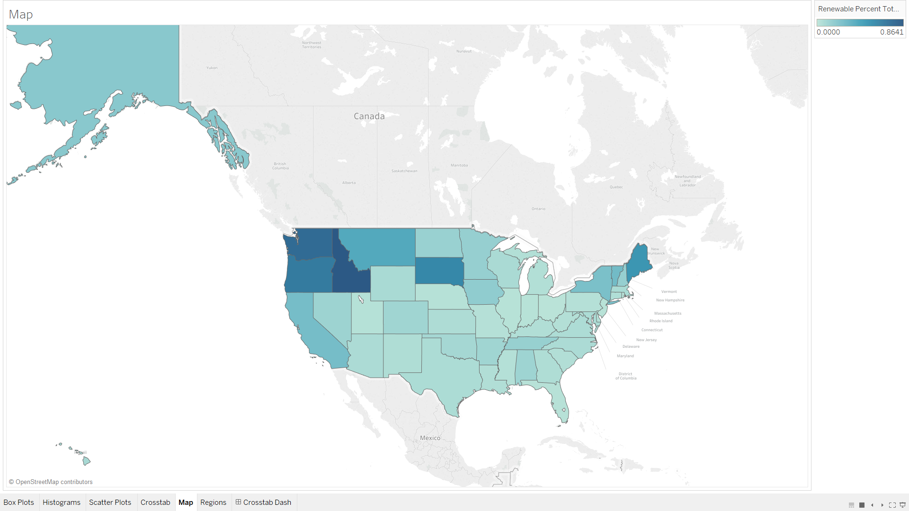
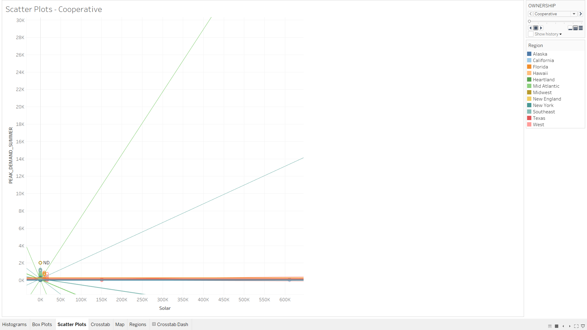
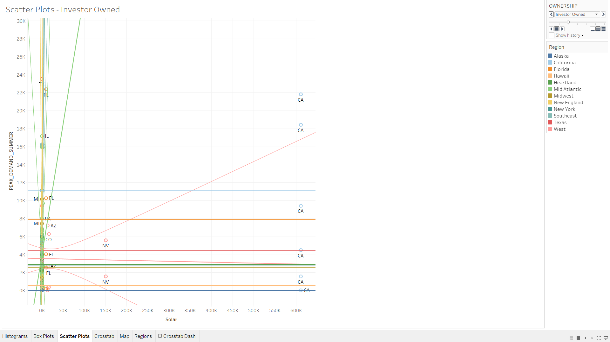
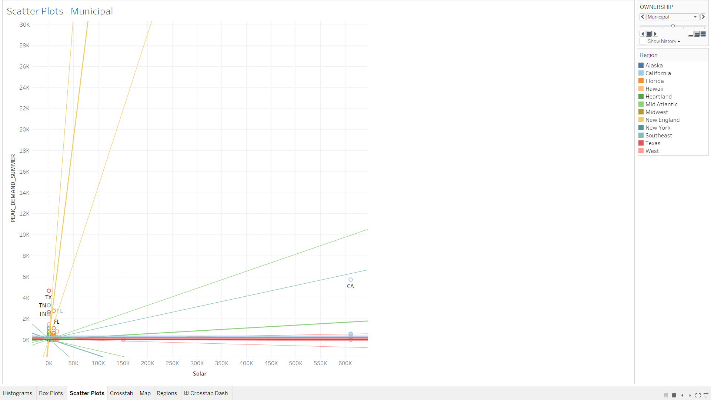
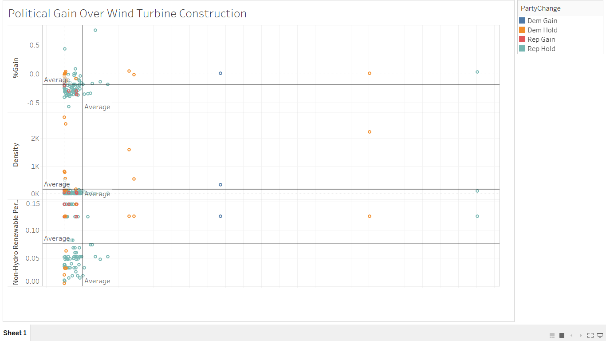
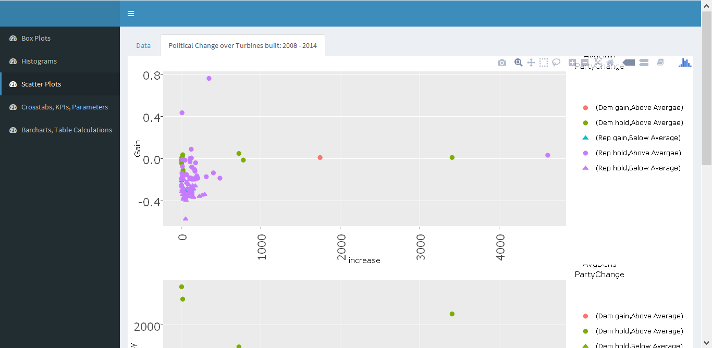
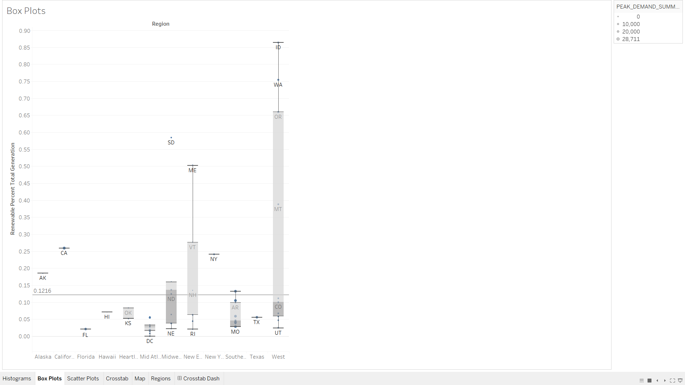
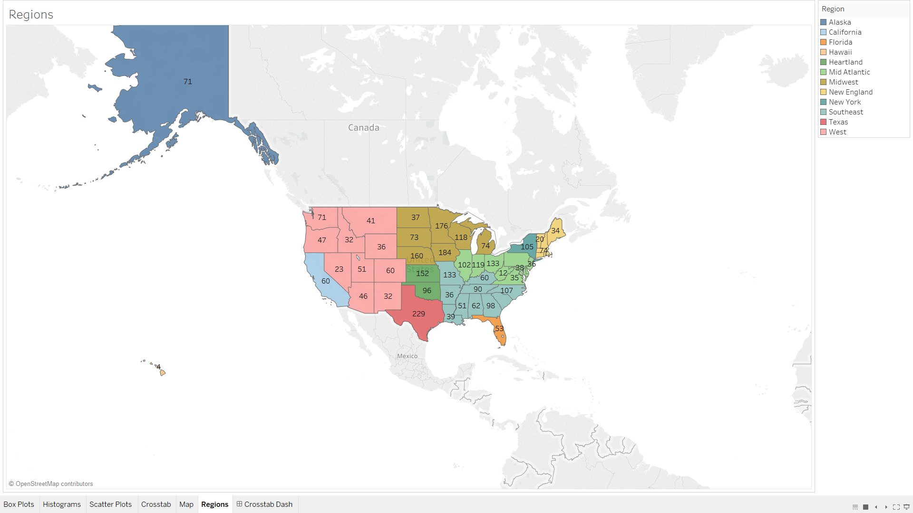

#**Introduction** 
<center></center>
<br></br>
In this R notebook we visualize data from the department of energy that tracks energy production by state in 2009, from renewable energy to oil and gas. We thought this data was intresting because by joining to other data sets (by state) such as the census data we can take an in-depth look at a given state or an overall view of the energy production in the country or trends in certain regions. In the following sections we will show the steps taken to go from raw data from data.world to Tableau and Shiney visualizations.  
<br></br>
<center></center>

#**Data**
<br></br>
Our main data set: energyByStateClean.csv features state by state information of energy related statistics such as alternative energy production (solar, wind, hydropower), fossil fuel and natural gass energy production, and nuclear energy production in MWH (MegaWatt-Hour) which is a unit of energy with 1MWH being roughly enough energy to power 300 homes for an hour. In our previous project we attempted to use information from the census data to explore the effects of demographics and employment on energy production but found it difficult to establish conclusive relationships which is why in the project we chose to focus on the diffrent facets of the energy production buisness. 
All of our data was taken directly from data.world, queried and then uploaded to our private data set to be cleaned, further queried and joined to other data sets. 
<br></br>


#**R Configuration**
```{r sessionInfo}
require(jsonlite)
require(readr)
require(dplyr)
require(plyr)
require(RCurl)
sessionInfo()
```

#**ETL**
The following is our ETL which we used to extract and clean our raw data.
```{r, code = readLines("../01 Data/ETL.R"), eval=FALSE}
```


#**Vizualization #1** 
## Effects of Summer Peak Power and Type of Utility Plant 
For this visualization I used additional data sets from the department of energy (and for the same year) which covered information about electrical utility plants, including their revenue (in thousands of dollars), customers, energy production (MWH) and other information such as their summer peak power demand (MW). Here we explore a scatterplot of three different types of utility ownership and their effects on solar power production in the state and their summer peak power demand. We see that where summer peak power demand is high we get more Investor owned utilities without much of an increase in solar power meaning that we should prefer municipal owned utilities to increase our reliance on solar power in hot and sunny places. 

<br> </br>
<center></center>
<center></center>
<center></center>
<br> </br> 

Steps:<br>
1. Uncheck Aggregate Measures <br>
2. Drag Peak_Demand_Summer to rows <br> 
3. Filter out Peak_Demand_Summer null values<br> 
4. Drag Solar to columns <br>
5. Drag Region to color <br>
6. Drag State to label <br>
7. Click on the Analytics tab and double click on trend line (linear)<br>
8. Lastly drag ownership to Pages. <br>


#**Visualizaiton #2**
##Tempest Tantrum: The Limited Political Influence of Windturbine Construction in Rural America:

<center></center>
Shiny
<center></center>


#**Visualizaiton #3** 
##FERNANDO MAIN:
<br></br>
<center></center>
<br></br>

#**Visualizaiton #4** 
##ALVARO viz 2: Exploring the data
In this visualization we begin to explore utility ownership type by region, by using a crosstab to show the average price per customer which is a calculated field (revenue/number of customers in thousands of dollars) I noticed that there was some disparities in prices so I also added an average revenue color box and sized it by the number of utilities present in that region and category. I found that the investor owned utilities offered less competition, higher revenues and higher price per customer. Also I included a map colored by the regions and labeled by the number of utilities with a Tableau Action to go from the crosstab to the general region. 
<br></br>
<center></center>
<center></center>
<br></br>

Crosstab <br>
1. Start with two dimensions: Ownership and Region<br>
2. Create calculated field PricePerCustomer = Total_Revenues/Total_Customers <br>
3. Drag PricePerCustomer onto Label and set it to average <br>
4. Drag Owners to size and set it as a count (to count the number of utilities) <br>
5. Drag Total_Revenues and set it to color, change color to red <br>

Map:<br>
1. Modify the State Dimension and set its geographic role to state/province <br>
2. Set the auto generated longitude and latitude from state as columns and rows <br>
3. Drag State to detail (so you can hover over it) <br>
4. Drag Region to color <br>
5. Drag Region to label, set it to count (since each utility will add to count in a given region) <br>
6. Add an action by going to worksheet ??? Actions, and then add a filter between the two.<br>


#**Visualizaiton #5** 
##ALVARO viz 3: Boxplot Exploration  
Here we continue to explore the data by creating a box plot that looks at each region and the percent of renewable energy of each state. I thought it would be interesting to explore the relationship between percent of renewable energy and the peak summer power consumption so I sized each dot by their relative summer peak value (I could have done the same with winter). We see that there are states with very high renewable energy percentage and small peak summer power values which is probably due to the high percentage of wind and other renewables as oppose to solar energy. Also we can see that the regions are somewhat grouped by their similar climate since they share very similar peak summer power values.
<br></br>
<center></center>
<br></br>

Steps: <br>
1. Uncheck aggregate measures <br>
2. Drag renewable percent to Rows, and select bar chart under the show me <br>
3. Drag abbreviation to label (to label each state) <br>
4. Drag Peak_Demand_Summer to size  <br>


#**Visualizaiton #6** 
Jacob viz 2:
<br></br>
<center></center>
<br></br>

#**Visualizaiton #7** 
Jacob viz 3:
<br></br>
<center></center>
<br></br>

#**Visualizaiton #8** 
Fernando viz 2:
<br></br>
<center></center>
<br></br>

#**Visualizaiton #9** 
Fernando viz 3:
<br></br>
<center></center>
<br></br>
