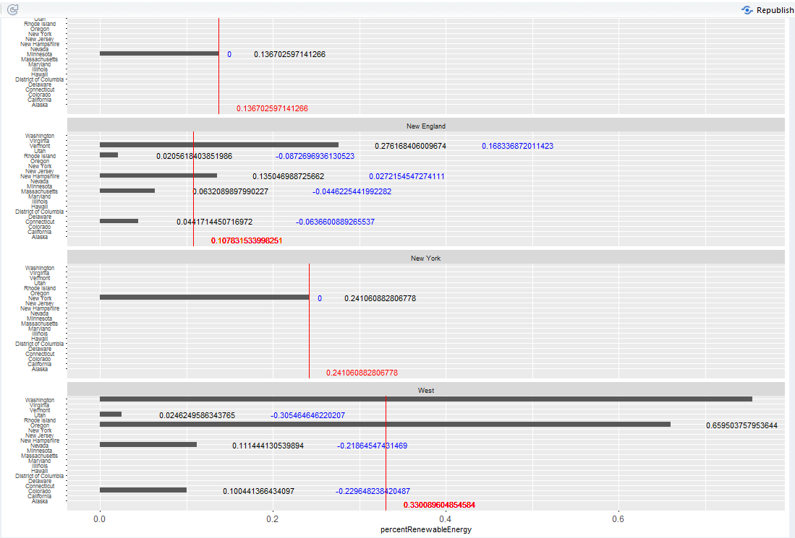

```{r}
require(jsonlite)
require(readr)
require(dplyr)
require(plyr)
require(RCurl)
sessionInfo()
```

Table of Contents: 

  Overview - 2009 Department of Energy data

  1.Alvaro's Visualizaiton (tableau + pngs) 
  
  2.Jacob's Visualization (tableau + png) 
  
  3.Fernando's Visualization (tableau + png) 

  
  
#**Overview** 
<center></center>
<br></br>
We used data from the department of energy that tracks energy production by state in 2009, from renewable energy to oil and gas. We thought this data was intresting because by joining to other data sets by state such as the census data we can take an in-depth look at a given state or an overall view of the energy production in the country or trends in certain regions. For our final project we might take what we learned from this project and include another data set which tracks oil production over the last 100 years in the US (by state) to draw some conclusions on the state of energy production in the US and its future development. 
<br></br>

#**Alvaro Medel** 
I joined our energy data to census data concering employment and my visualizaiton breaks down by region and available work force considered young (16-34).We see that regions with high young workforce tend to have a high percentage of renewable energy.https://pavilionall.shinyapps.io/alvshineybar/
<br> </br>
Shiny<center></center>
<br> </br> 

#**Jacob Temple**
In my visualization I join Department of Energy Data with a state results table of the recent 2016 election made by querying the official county level table. The Tableau representation seperates all states into bins based on based on the percent that voted for Hillary Clinton and the percent of renewable enrgy utilized by that state. The barchart created illustrates the percent of renewable energy used, and each pane shows the average percent of renewable enrgy used for each bin of Hillary's success. The bars are colored as to the winnner of that's states election because one of Hillary's bins has states she won and lost. One might think that states with a higher percentage of untilized renewable energy would have voted for Hillary Clinton due to President Trump's promise to uphold the coal industry, but our illustration shows that the state with the highest percent of renewable energy utilized, Idaho, actually had a very low turn out for Hillary Clinton. There is however a general positive coorelation between percent of renewable energy and Hillary voters. The Shiny application can be seen at https://jacobbtemple.shinyapps.io/Project6/
Tableau
<center></center>
Shiny
<center></center>


<br></br>
<br> </br>


#**Fernando Ruiz** 
This visualization joins Department of Energy data with the US Census data regarding median Monthly Housing Expenses, joining via States. The Tableau visualization uses a set defined by States that have the median Monthy Housing Expenses exceeding $1000. In the barchart, each Region has a pane, and each pane shows the States of the corresponding region on the Vertical Axis, and the percent of Renewable Energy produced on the Horizontal Axis. Each Pane has a Vertical line that shows the calculated average percent of renewable energy for each Region. The label at the end of each bar shows the difference of percentages between the State's ratio and the Region's ratio. In this dataset, some Regions have only one pertaining State (Region name = State), so the ratio difference is 0 for some. The Visualization shows the West region having the highest Average percent Renewable Energy at around 33%, with the State of Washington having an overall State-high 74%. Meanwhile, the Mid Atlantic Region has the lowest average Percent Renewable Energy at around 3%. 
The Shiney visualization has an identical format to the Tableau Visualization, including using the set of States with a Median Monthy Housing Expense exceeding $1000.
https://fernandoruiz320.shinyapps.io/project6ruiz/


Tableau
<center></center>

Shiney

<center></center>
<br> </br>
<br></br>

 

