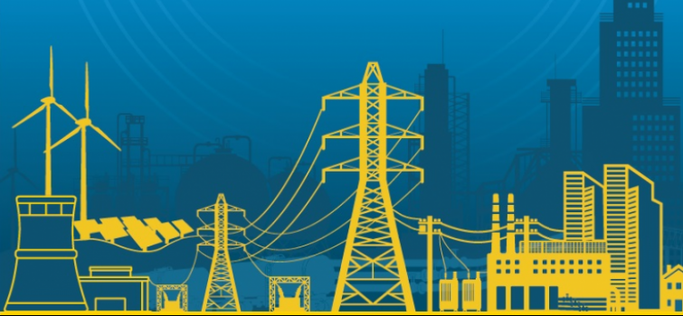
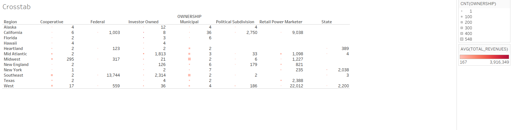
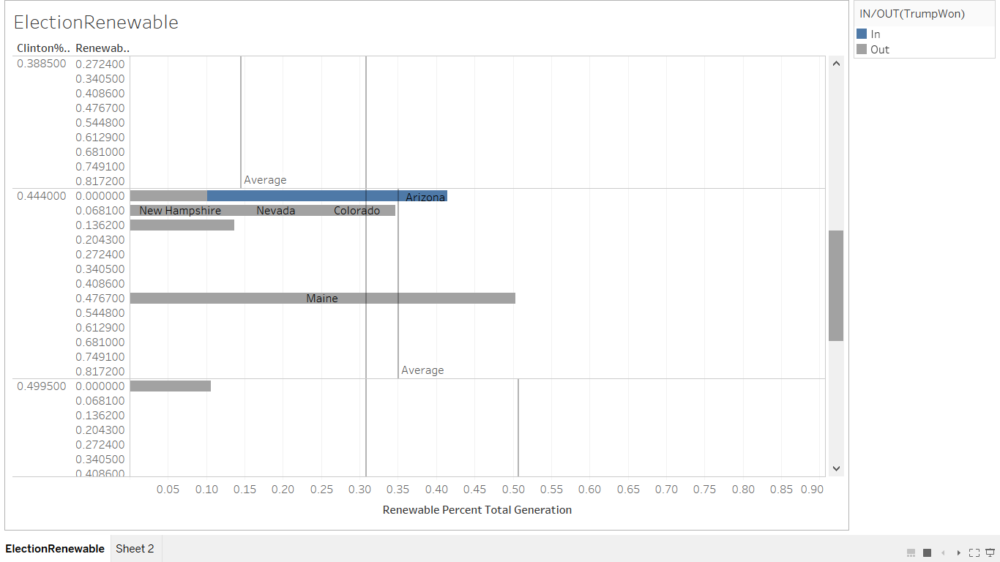
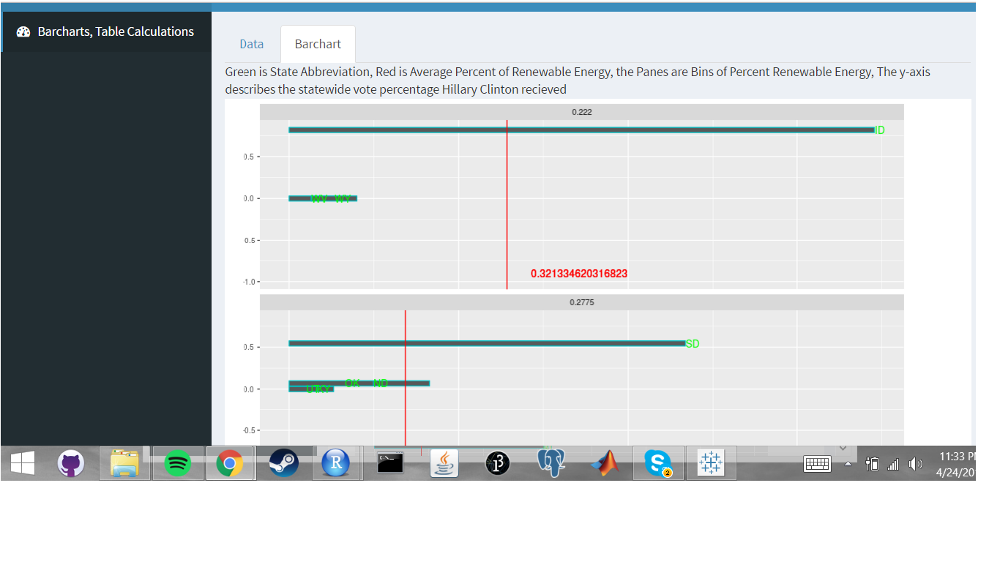
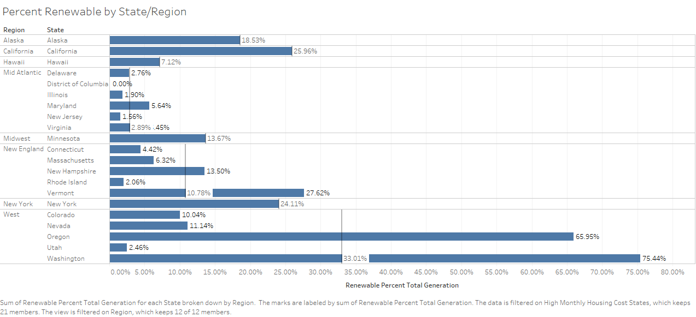

#**Introduction** 
<center></center>
<br></br>
We used data from the department of energy that tracks energy production by state in 2009, from renewable energy to oil and gas. We thought this data was intresting because by joining to other data sets by state such as the census data we can take an in-depth look at a given state or an overall view of the energy production in the country or trends in certain regions. For our final project we might take what we learned from this project and include another data set which tracks oil production over the last 100 years in the US (by state) to draw some conclusions on the state of energy production in the US and its future development. 
<br></br>

#**Data**
WORK: write about why we chose this data set and the other datasets we joined on.

#**R Configuration**
```{r sessionInfo}
require(jsonlite)
require(readr)
require(dplyr)
require(plyr)
require(RCurl)
sessionInfo()
```

#**ETL**
Put ETL here with step by step instruction
```{r, code = readLines("../01 Data/ETL.R"), eval=FALSE}
```

#**Vizualization #1** 
ALVARO MAIN:
<br> </br>
<center></center>
<br> </br> 

#**Visualizaiton #2**
JACOB MAIN:
<center></center>
Shiny
<center></center>


#**Visualizaiton #3** 
FERNANDO MAIN:
<br></br>
<center></center>
<br></br>

#**Visualizaiton #4** 
ALV viz 2:
<br></br>
<center></center>
<br></br>

#**Visualizaiton #5** 
ALV viz 3:
<br></br>
<center></center>
<br></br>

#**Visualizaiton #6** 
Jacob viz 2:
<br></br>
<center></center>
<br></br>

#**Visualizaiton #7** 
Jacob viz 3:
<br></br>
<center></center>
<br></br>

#**Visualizaiton #8** 
Fernando viz 2:
<br></br>
<center></center>
<br></br>

#**Visualizaiton #9** 
Fernando viz 3:
<br></br>
<center></center>
<br></br>